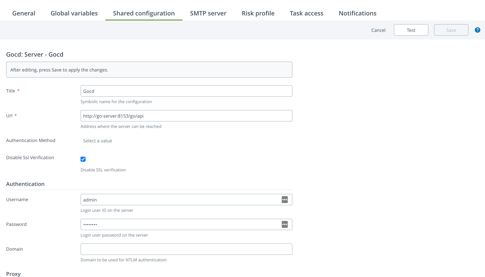
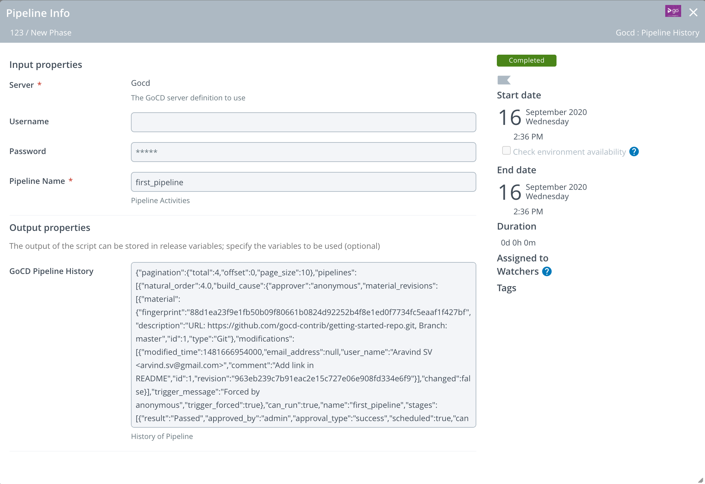
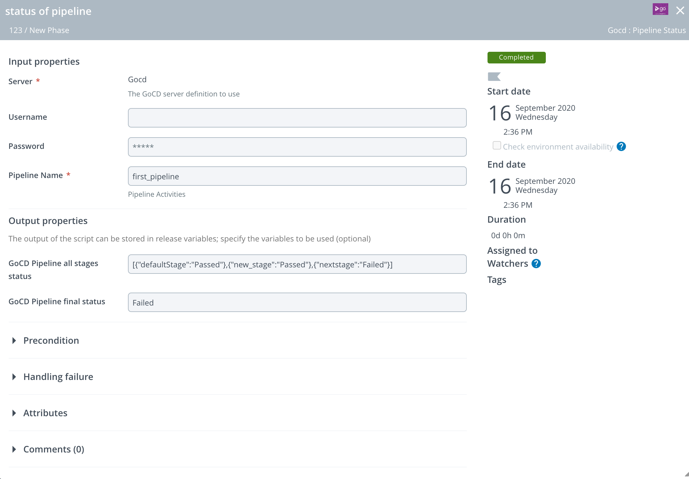

# XL Release GoCD Plugin

[![License: MIT][xlr-gocd-plugin-license-image] ][xlr-gocd-plugin-license-url]

This document describes the functionality provided by the XL Release xlr-gocd-plugin.

See the [XL Release reference manual](https://docs.xebialabs.com/xl-release) for background information on XL Release and release automation concepts.

(#to-run-demo-or-dev-version-set-up-docker-containers-for-both-xlr-and-the-gocd-platform)


## Overview

This plugin offers an interface from XL Release to GoCD.

## Requirements

* XL Release**   9.0.0+
* This plugin has been tested with XL Release 9.7.0 and GoCD 17.9.0

## Installation

* Copy the latest JAR file into the `XL_RELEASE_SERVER/plugins/__local__/` or `XL_RELEASE_SERVER/plugins/xlr-official/` directory.
* Restart the XL Release server.

## Usage

### GoCD Plugin Configuration

Configuring the GoCD Plugin in Shared Configurations




### GoCD Plugin Tasks:

1. GoCD: Pipeline History
2. GoCD: Pipeline Status

#### 1. GoCD: Pipeline History

This task to retrieve a pipline history (as GoCD pipeline history api gives paginated results with latest 10 executions)
This history data stores in an XL Release variable.



#### 2. GoCD: Pipeline Status

This task to scan a pipline and stores the status by stages in a json, and final status of pipeline in an XL Release variable.   



## Developers

Build and package the plugins with...

```bash
./gradlew assemble
./gradlew clean build
```

[docker-compose](docker-compose.yaml) file to provision dev environment with GoCd (17.9.0) and XLR (9.7.0).

```bash
docker-compose up
```

To bring down containers

```bash
docker-compose down
```

## References

+ [GoCD REST api](https://api.gocd.org/current/)

[xlr-gocd-plugin-license-image]: https://img.shields.io/badge/License-MIT-yellow.svg
[xlr-gocd-plugin-license-url]: https://opensource.org/licenses/MIT